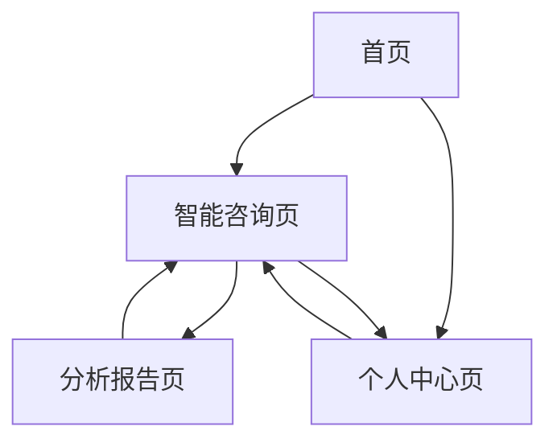

## 1. 产品概述
国学命理智能体应用是一个基于AI技术的传统文化咨询平台，集成周易占卜、星座运势、生肖配对、起名建议、八字命理分析五大核心功能。通过自然语言交互，为用户提供个性化的命理咨询服务，帮助用户了解传统文化智慧在现代生活中的应用。

目标用户群体包括对中国传统文化感兴趣的年轻人、需要命理咨询的用户、以及国学文化学习者。产品价值在于将传统命理学知识与现代AI技术相结合，提供便捷、智能的文化体验服务。

## 2. 核心功能

### 2.1 用户角色
| 角色 | 注册方式 | 核心权限 |
|------|----------|----------|
| 普通用户 | 手机号/邮箱注册 | 基础命理咨询、历史记录查看、反馈建议 |
| VIP用户 | 付费升级 | 高级命理分析、详细报告、专家咨询、优先服务 |
| 管理员 | 后台创建 | 系统管理、用户管理、内容审核、数据统计 |

### 2.2 功能模块
产品包含以下主要页面：
1. **首页**：功能导航、热门服务、使用引导、用户评价
2. **智能咨询页**：对话界面、功能选择、历史记录、结果展示
3. **个人中心页**：用户信息、VIP服务、历史记录、设置选项
4. **分析报告页**：详细分析、可视化图表、建议方案、分享功能

### 2.3 页面详情
| 页面名称 | 模块名称 | 功能描述 |
|----------|----------|----------|
| 首页 | 功能导航区 | 展示五大核心功能入口（周易、星座、生肖、起名、八字），支持快速跳转 |
| 首页 | 热门服务区 | 显示用户最常用的功能模块，基于使用统计动态推荐 |
| 首页 | 使用引导 | 新手引导流程，包含功能介绍、使用教程、示例演示 |
| 首页 | 用户评价 | 展示真实用户评价，支持点赞互动，提升产品信任度 |
| 智能咨询页 | 对话界面 | 支持自然语言输入，AI智能理解用户意图，多轮对话上下文保持 |
| 智能咨询页 | 功能选择 | 提供功能快捷选择面板，支持一键切换咨询类型 |
| 智能咨询页 | 历史记录 | 显示最近咨询记录，支持搜索、筛选、重新咨询 |
| 智能咨询页 | 结果展示 | 图文结合展示分析结果，支持LaTeX数学公式渲染 |
| 个人中心页 | 用户信息 | 显示头像、昵称、会员等级、积分余额等基本信息 |
| 个人中心页 | VIP服务 | 展示会员权益、开通入口、续费管理、专属客服 |
| 个人中心页 | 历史记录 | 完整的咨询历史，支持按时间、类型筛选，导出报告 |
| 个人中心页 | 设置选项 | 通知设置、隐私设置、账号安全、帮助反馈 |
| 分析报告页 | 详细分析 | 深度解读分析结果，包含传统理论依据和现代解释 |
| 分析报告页 | 可视化图表 | 使用图表展示命理数据，如八字五行分布、运势趋势图 |
| 分析报告页 | 建议方案 | 基于分析结果提供实用建议，包含时间、方位、颜色等 |
| 分析报告页 | 分享功能 | 支持生成分享卡片，包含二维码、简洁版本的分析结果 |

## 3. 核心流程

### 3.1 用户咨询流程
用户进入智能咨询页面，可以通过文字输入或选择预设功能进行咨询。系统通过AI Agent理解用户意图，调用相应的命理分析工具，结合知识库进行推理分析，最终生成个性化的咨询报告。

### 3.2 多Agent协作流程
主Agent负责接收用户请求并进行意图识别，根据咨询类型路由到对应的子Agent。子Agent调用专业工具进行计算分析，通过检索知识库获取相关信息，经过重排序和融合后生成最终答案。

### 3.3 页面导航流程

## 4. 用户界面设计

### 4.1 设计风格
- **主色调**：深红色（#C41E3A）体现传统文化底蕴，金色（#FFD700）点缀突出尊贵感
- **辅助色**：墨黑色（#2C2C2C）背景，米白色（#F5F5DC）卡片，营造古典书香氛围
- **按钮样式**：圆角矩形设计，悬停时有轻微阴影效果，点击时有按压动画
- **字体选择**：标题使用思源宋体，正文使用思源黑体，数字使用Roboto Mono等宽字体
- **图标风格**：采用简洁线条风格的国风图标，如太极、八卦、祥云等传统元素

### 4.2 页面设计概览
| 页面名称 | 模块名称 | UI元素 |
|----------|----------|--------|
| 首页 | 功能导航区 | 采用卡片式布局，每个功能配有专属图标和渐变背景，悬停时有缩放动画效果 |
| 智能咨询页 | 对话界面 | 类似微信聊天的气泡设计，用户消息在右侧蓝色气泡，AI回复在左侧白色气泡 |
| 分析报告页 | 可视化图表 | 使用ECharts库，包含饼图、雷达图、折线图等多种图表类型，支持交互动画 |
| 个人中心页 | 用户信息 | 顶部大背景图配用户头像圆形裁剪，信息采用列表分组展示，清晰易读 |

### 4.3 响应式设计
产品采用桌面端优先的设计策略，同时支持移动端自适应。在平板和手机上，导航栏会转换为汉堡菜单，功能卡片会重新排列为单列布局。触摸交互方面，增加了滑动切换、长按复制、双指缩放等手势支持。

### 4.4 3D场景指导
应用中的太极图、八卦图等传统元素采用3D渲染技术，营造沉浸式体验。场景环境设置为暗色背景配粒子光效，主光源为暖色调，辅助光源营造层次感。相机采用45度俯视角度，支持鼠标拖拽旋转查看细节。
<!-- 后期处理添加辉光效果和景深，突出视觉重点。 -->