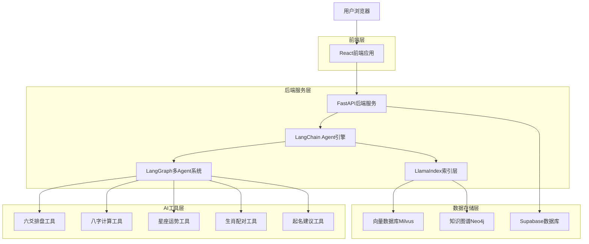
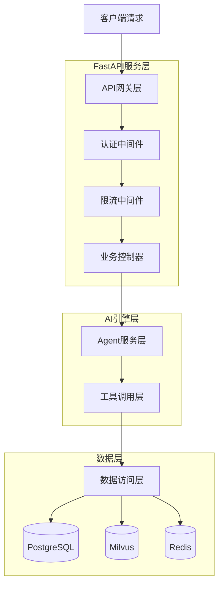
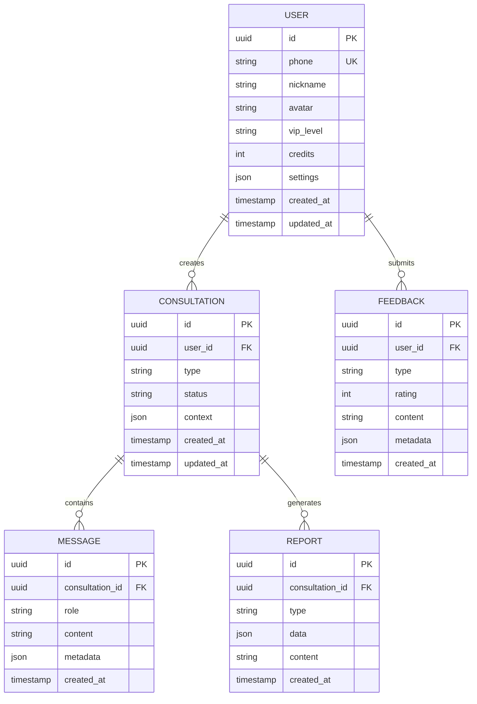

## 1. 架构设计



## 2. 技术描述

- **前端**: React@18 + TypeScript@5 + Vite@5 + Ant Design@5 + Tailwind CSS@3
- **初始化工具**: vite-init
- **后端**: FastAPI@0.104 + Python@3.11 + Uvicorn@0.24
- **AI框架**: LangChain@0.1 + LangGraph@0.0 + LlamaIndex@0.9
- **数据库**: PostgreSQL@15 + pgvector@0.5 + Redis@7 + Milvus@2.3
- **向量模型**: BGE-M3@0.5 + BGE-Reranker@0.2
- **容器化**: Docker@24 + Docker Compose@2

## 3. 路由定义

| 路由 | 用途 |
|------|------|
| / | 首页，展示功能导航和产品介绍 |
| /chat | 智能咨询页面，提供AI对话界面 |
| /profile | 个人中心，用户信息和历史记录 |
| /report/:id | 分析报告页面，展示详细分析结果 |
| /settings | 设置页面，用户偏好和系统配置 |
| /api/auth/login | 用户登录接口 |
| /api/auth/register | 用户注册接口 |
| /api/chat | 聊天接口，支持SSE流式返回 |
| /api/upload | 文件上传接口，支持古籍文档 |
| /api/feedback | 用户反馈接口 |
| /api/health | 健康检查接口 |

## 4. API定义

### 4.1 核心API

#### 用户认证
```
POST /api/auth/login
```

请求参数：
| 参数名 | 类型 | 必填 | 描述 |
|--------|------|------|------|
| phone | string | 是 | 手机号（11位） |
| code | string | 是 | 短信验证码（6位） |

响应参数：
| 参数名 | 类型 | 描述 |
|--------|------|------|
| token | string | JWT访问令牌 |
| refresh_token | string | 刷新令牌 |
| expires_in | int | 过期时间（秒） |

示例：
```json
{
  "phone": "13800138000",
  "code": "123456"
}
```

#### 智能聊天
```
POST /api/chat
```

请求参数：
| 参数名 | 类型 | 必填 | 描述 |
|--------|------|------|------|
| message | string | 是 | 用户输入消息 |
| session_id | string | 否 | 会话ID（不传则新建） |
| function | string | 否 | 指定功能类型 |

响应参数：
| 参数名 | 类型 | 描述 |
|--------|------|------|
| session_id | string | 会话ID |
| response | string | AI回复内容 |
| sources | array | 参考来源 |
| tokens | object | Token消耗统计 |

## 5. 服务器架构图



## 6. 数据模型

### 6.1 数据模型定义



### 6.2 数据定义语言

#### 用户表（users）
```sql
-- 创建用户表
CREATE TABLE users (
  id UUID PRIMARY KEY DEFAULT gen_random_uuid(),
  phone VARCHAR(11) UNIQUE NOT NULL,
  nickname VARCHAR(50) DEFAULT '国学爱好者',
  avatar TEXT DEFAULT 'https://cdn.example.com/avatar/default.png',
  vip_level VARCHAR(20) DEFAULT 'free' CHECK (vip_level IN ('free', 'monthly', 'yearly', 'lifetime')),
  credits INTEGER DEFAULT 10 CHECK (credits >= 0),
  settings JSONB DEFAULT '{"theme": "auto", "language": "zh-CN"}',
  created_at TIMESTAMP WITH TIME ZONE DEFAULT NOW(),
  updated_at TIMESTAMP WITH TIME ZONE DEFAULT NOW()
);

-- 创建索引
CREATE INDEX idx_users_phone ON users(phone);
CREATE INDEX idx_users_vip_level ON users(vip_level);

-- 创建更新触发器
CREATE OR REPLACE FUNCTION update_updated_at_column()
RETURNS TRIGGER AS $$
BEGIN
  NEW.updated_at = NOW();
  RETURN NEW;
END;
$$ language 'plpgsql';

CREATE TRIGGER update_users_updated_at 
  BEFORE UPDATE ON users 
  FOR EACH ROW 
  EXECUTE FUNCTION update_updated_at_column();
```

#### 咨询记录表（consultations）
```sql
-- 创建咨询记录表
CREATE TABLE consultations (
  id UUID PRIMARY KEY DEFAULT gen_random_uuid(),
  user_id UUID NOT NULL REFERENCES users(id) ON DELETE CASCADE,
  type VARCHAR(20) NOT NULL CHECK (type IN ('iching', 'horoscope', 'zodiac', 'naming', 'bazi')),
  status VARCHAR(20) DEFAULT 'active' CHECK (status IN ('active', 'completed', 'archived')),
  context JSONB DEFAULT '{}',
  created_at TIMESTAMP WITH TIME ZONE DEFAULT NOW(),
  updated_at TIMESTAMP WITH TIME ZONE DEFAULT NOW()
);

-- 创建索引
CREATE INDEX idx_consultations_user_id ON consultations(user_id);
CREATE INDEX idx_consultations_type ON consultations(type);
CREATE INDEX idx_consultations_status ON consultations(status);
CREATE INDEX idx_consultations_created_at ON consultations(created_at DESC);

-- 创建更新触发器
CREATE TRIGGER update_consultations_updated_at 
  BEFORE UPDATE ON consultations 
  FOR EACH ROW 
  EXECUTE FUNCTION update_updated_at_column();
```

#### 消息表（messages）
```sql
-- 创建消息表
CREATE TABLE messages (
  id UUID PRIMARY KEY DEFAULT gen_random_uuid(),
  consultation_id UUID NOT NULL REFERENCES consultations(id) ON DELETE CASCADE,
  role VARCHAR(20) NOT NULL CHECK (role IN ('user', 'assistant', 'system')),
  content TEXT NOT NULL,
  metadata JSONB DEFAULT '{}',
  created_at TIMESTAMP WITH TIME ZONE DEFAULT NOW()
);

-- 创建索引
CREATE INDEX idx_messages_consultation_id ON messages(consultation_id);
CREATE INDEX idx_messages_role ON messages(role);
CREATE INDEX idx_messages_created_at ON messages(created_at);
```

#### 向量表（embeddings）
```sql
-- 创建向量扩展
CREATE EXTENSION IF NOT EXISTS vector;

-- 创建向量表
CREATE TABLE embeddings (
  id UUID PRIMARY KEY DEFAULT gen_random_uuid(),
  content TEXT NOT NULL,
  embedding vector(1024),
  metadata JSONB DEFAULT '{}',
  created_at TIMESTAMP WITH TIME ZONE DEFAULT NOW()
);

-- 创建向量索引
CREATE INDEX idx_embeddings_embedding ON embeddings 
  USING ivfflat (embedding vector_cosine_ops)
  WITH (lists = 100);

-- 创建全文搜索索引
CREATE INDEX idx_embeddings_content_fts ON embeddings 
  USING gin (to_tsvector('chinese', content));
```

### 6.3 权限配置
```sql
-- 基础权限配置
GRANT SELECT ON users TO anon;
GRANT SELECT ON consultations TO anon;
GRANT SELECT ON messages TO anon;
GRANT SELECT ON embeddings TO anon;

-- 认证用户权限
GRANT ALL PRIVILEGES ON users TO authenticated;
GRANT ALL PRIVILEGES ON consultations TO authenticated;
GRANT ALL PRIVILEGES ON messages TO authenticated;
GRANT ALL PRIVILEGES ON embeddings TO authenticated;

-- RLS策略（行级安全）
ALTER TABLE users ENABLE ROW LEVEL SECURITY;
ALTER TABLE consultations ENABLE ROW LEVEL SECURITY;
ALTER TABLE messages ENABLE ROW LEVEL SECURITY;

-- 用户只能查看和修改自己的数据
CREATE POLICY users_policy ON users
  FOR ALL USING (auth.uid() = id);

CREATE POLICY consultations_policy ON consultations
  FOR ALL USING (auth.uid() = user_id);

CREATE POLICY messages_policy ON messages
  FOR ALL USING (
    consultation_id IN (
      SELECT id FROM consultations WHERE user_id = auth.uid()
    )
  );
```